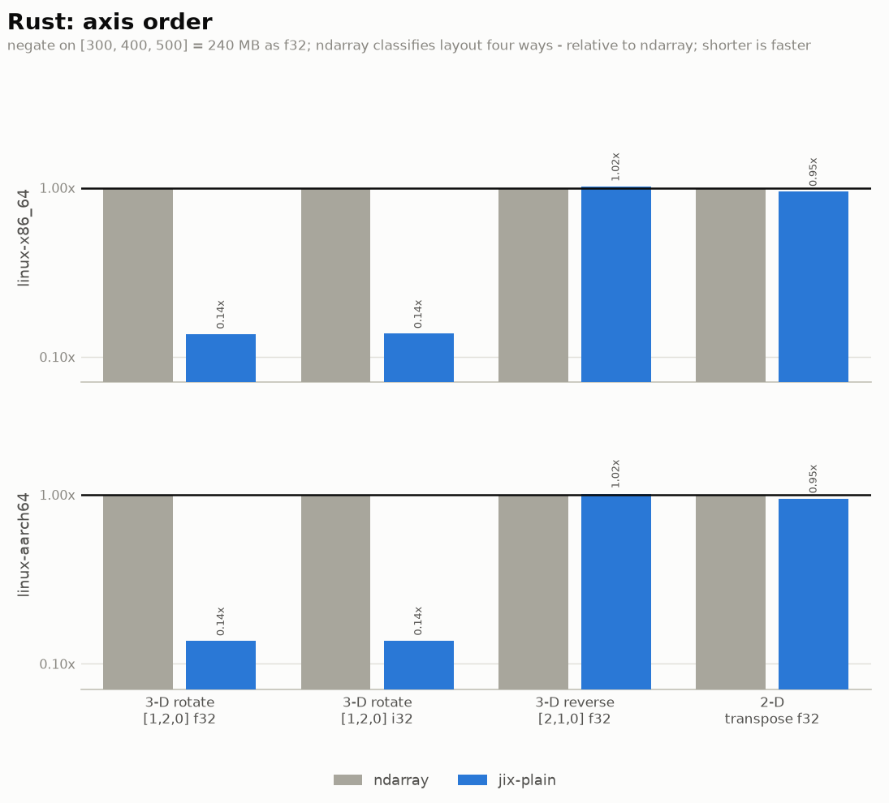

> **DRAFT.** Rendered from fake benchmark output by `build_fake_report.py` so the plot style can be
> iterated on before any real run. Some values are real (measured locally, single run); the rest are
> invented. Do not quote anything here.

# jix benchmarks

jix is a multi-dimensional array library with block-compressed storage and lazy operation chains.
This page measures both against the libraries you would otherwise reach for: `ndarray` in Rust,
NumPy, Blosc2 and Zarr in Python.

**Machines.** GitHub-hosted runners: `ubuntu-24.04` (x86_64) and `ubuntu-24.04-arm` (aarch64).
rustc 1.89.0, Python 3.13, numpy 2.3.1, blosc2 4.9.1, zarr 3.0.6.

**Everything is single-threaded.** jix has no threading. Blosc2, Zarr and numexpr are each pinned to
one thread, and NumPy's elementwise and reduction kernels are single-threaded regardless. A
multi-threaded Blosc2 will beat jix on throughput-bound work; that comparison is not on this page.

**Codec settings are matched** across jix, Blosc2 and Zarr: zstd level 3, byte-shuffle. The array
is `[130000, 200]` throughout, in Rust and Python alike - 104 MB as `f32`.

**Reading the plots.** Each tick on the x axis is one configuration; each bar is one library. Bars
are scaled to the baseline - NumPy in Python, `ndarray` in Rust - which is the gray bar and which by
definition tops out on the black rule at 1x. **Shorter is better**: a bar at 4x took four times as
long, or used four times the memory, or stored four times the bytes. The one exception is
compression throughput, which is plotted in absolute MB/s with no baseline, where taller is faster.

The scale is logarithmic, so a bar twice the height of another is not twice the number. The value
above each bar is exact, and the collapsed table under each plot carries the absolute measurements.

`jix` and `blosc2` always mean the byte-shuffled build - the configuration anyone would actually
use. The unfiltered variants appear only in the compression section, where the filter is the thing
being measured. `jix-plain` is jix over an ordinary uncompressed in-memory buffer: it isolates the
cost of jix's operation machinery from the cost of decompression.

---

## Reading a region

The case block-compressed storage exists for: pull a small region out of a large array without
decompressing the whole thing. Every timed call reads a different one of 1024 randomly placed
regions, so nothing stays warm in cache.

NumPy is the floor, not a competitor: it holds the array uncompressed in RAM and a read is a slice
plus a memcpy. The question this plot answers is what you pay for the four-to-fifty-fold drop in
memory that the next section shows, and how that compares to the other libraries that offer the
same trade.

The first three cases are dominated by per-call overhead. The last three are where each read does
real work, and they are the honest measure of decode throughput - Zarr in particular spends most of
a small read inside its Python indexing layer rather than its codec.

The `block 64x200 / read 16x16` case is the one to learn from: a read smaller than a block still decompresses a
whole block and throws most of it away. **Match the block shape to how you read.** jix picks a
block shape from the CPU cache sizes when you do not pass one, which is a fair default and a poor
choice if your access pattern is lopsided.

`blosc2-chunked` is Blosc2 with `chunks` forced equal to `blocks`. Left to choose for itself Blosc2
picks ~8.7 MiB chunks against a 4 KiB block; the block is still the decompression unit, but walking
a large chunk's block table costs real time - about 2.3x here. It also silently rewrites a
requested `(64, 200)` block to `(52, 200)` unless `chunks` is pinned too. Both arms are on the plot
so Blosc2 is shown at its best as well as at its default.

Absolute numbers

| case | numpy | jix-plain | jix | blosc2 | blosc2-chunked | zarr |
|---|---|---|---|---|---|---|
| block 16x200 read 1x200 800 B | 472 ns | 590 ns | 1.89 us | 89.68 us | 40.12 us | 389.40 us |
| block 16x200 read 16x200 13 KB | 708 ns | 826 ns | 3.07 us | 94.40 us | 42.48 us | 401.20 us |
| block 64x200 read 16x16 1 KB | 413 ns | 531 ns | 4.25 us | 61.36 us | 49.56 us | 396.48 us |
| block 64x200 read 256x200 205 KB | 14.16 us | 15.34 us | 30.68 us | 151.04 us | 112.10 us | 495.60 us |
| block 64x200 read 4096x200 3 MB | 224.20 us | 236.00 us | 448.40 us | 1.04 ms | 920.40 us | 1.42 ms |
| block 64x200 read whole array 104 MB | 6.14 ms | 6.49 ms | 14.16 ms | 27.14 ms | 25.96 ms | 47.20 ms |

### Rust: against a raw `ndarray` slice

Absolute numbers

| case | ndarray | jix-plain | jix |
|---|---|---|---|
| block 32x32 read 32x32 4 KB | 330 ns | 354 ns | 1.89 us |
| block 32x32 read 1x200 800 B | 413 ns | 448 ns | 12.39 us |
| block 512x32 read 128x200 102 KB | 12.98 us | 13.57 us | 49.56 us |

---

## Compression

Each bar is what the library stores as a fraction of the raw array, `prod(shape) * itemsize`, so
NumPy is 1x by definition and shorter means smaller on disk. This is the one section where the
unfiltered builds appear, because the byte-shuffle filter is exactly what separates them.

Sizes track Blosc2 closely, which is what should happen - same codec, same filter, so what is
really being measured is the cost of the block layout. Zarr uses Blosc internally and lands on the
same numbers.

Absolute numbers

| case | numpy | jix-noshuffle | jix | blosc2-noshuffle | blosc2 | zarr |
|---|---|---|---|---|---|---|
| random | 1.0x smaller | 1.0x smaller | 1.0x smaller | 1.0x smaller | 1.0x smaller | 1.0x smaller |
| smooth | 1.0x smaller | 3.5x smaller | 3.9x smaller | 3.4x smaller | 3.7x smaller | 3.7x smaller |
| 16 unique | 1.0x smaller | 24.0x smaller | 31.0x smaller | 22.5x smaller | 28.4x smaller | 28.4x smaller |
| 4 unique | 1.0x smaller | 46.0x smaller | 55.2x smaller | 41.0x smaller | 48.6x smaller | 48.6x smaller |

Absolute throughput, in original array bytes per second - no baseline, and taller is faster. This
is the one plot on the page that is not a ratio: there is no meaningful NumPy arm to normalize
against, since not compressing is not a compression speed.

Note that the more compressible the data, the *faster* compression gets. That is the mechanism
behind the distribution cases in the next section.

Absolute numbers

| case | jix-noshuffle | jix | blosc2-noshuffle | blosc2 | zarr |
|---|---|---|---|---|---|
| random | 157 ms | 224 ms | 151 ms | 231 ms | 637 ms |
| smooth | 192 ms | 157 ms | 208 ms | 173 ms | 720 ms |
| 16 unique | 104 ms | 87 ms | 120 ms | 104 ms | 496 ms |
| 4 unique | 84 ms | 73 ms | 99 ms | 85 ms | 460 ms |

---

## Negate

On an uncompressed in-memory buffer jix matches NumPy. That parity is what makes the chain results
further down meaningful: entering a jix pipeline costs nothing that has to be earned back later.

Against the other compressed-array libraries jix is several times faster. Both write their result
into a plain uncompressed NumPy buffer - Blosc2's `expr[:]` does not re-compress on the way out, so
it is not being billed for a pass jix skips.

Absolute numbers

| case | numpy | jix-plain | jix | blosc2 | zarr |
|---|---|---|---|---|---|
| f32 | 2.55 ms | 2.58 ms | 58.53 ms | 522.74 ms | 36.34 ms |
| i32 | 2.61 ms | 2.66 ms | 53.10 ms | 495.60 ms | 35.40 ms |

### The same operation, on data that compresses differently

Nothing changes here but the number of distinct values in the data. Better compression means less
memory to move and longer zstd matches, so the operation gets faster. The same effect shows up in
the filter choice: byte-shuffled data negates measurably faster than unshuffled, with identical op
code on both sides.

It does not catch NumPy, and it should not be expected to. An elementwise operation writes a
full-size uncompressed output whatever the input was, so compression only ever helps the read half
of the work.

Absolute numbers

| case | numpy | jix-plain | jix | blosc2 | zarr |
|---|---|---|---|---|---|
| random | 2.55 ms | 2.58 ms | 113.75 ms | 601.80 ms | 51.92 ms |
| smooth | 2.55 ms | 2.58 ms | 58.53 ms | 522.74 ms | 36.34 ms |
| 16 unique | 2.55 ms | 2.58 ms | 40.71 ms | 247.80 ms | 24.78 ms |
| 4 unique | 2.55 ms | 2.58 ms | 25.13 ms | 182.90 ms | 18.88 ms |

---

## Add

The same shape as negate with two operands instead of one.

Absolute numbers

| case | numpy | jix-plain | jix | blosc2 | zarr |
|---|---|---|---|---|---|
| f32 | 3.41 ms | 3.40 ms | 116.94 ms | 661.98 ms | 69.86 ms |
| i32 | 3.48 ms | 3.47 ms | 110.92 ms | 637.20 ms | 68.44 ms |

---

## Reductions

`sum` and `std` are on one plot because they land on opposite sides of the rule, and splitting them
would be choosing which result to show.

jix's reduction kernels read in whatever layout the source already has rather than forcing a
canonical order, and they vectorize integer accumulation that NumPy leaves scalar. **Compare the
two platform rows before reading anything into the integer numbers**: jix's kernels are tuned on
arm64, and NumPy is a general-purpose library with far more x86 attention behind its hot paths.
That is a statement about which machine you are on, not about which library is faster.

`std` goes the other way on every platform - a real deficiency in the kernel rather than a
measurement artifact, and the clearest thing to fix next. On compressed input Blosc2 also edges jix
out on reductions while losing badly on elementwise; both facts are in the same chart.

Absolute numbers

| case | numpy | jix-plain | jix | blosc2 | zarr |
|---|---|---|---|---|---|
| sum f32 axis 0 | 2.75 ms | 2.40 ms | 58.53 ms | 40.95 ms | 36.46 ms |
| sum f32 axis 1 | 4.68 ms | 1.83 ms | 57.82 ms | 42.83 ms | 38.82 ms |
| sum f32 all | 3.79 ms | 1.55 ms | 57.35 ms | 46.73 ms | 37.17 ms |
| sum i32 axis 0 | 13.81 ms | 9.57 ms | 67.50 ms | 24.07 ms | 43.78 ms |
| sum i32 all | 5.18 ms | 4.65 ms | 63.65 ms | 16.76 ms | 34.93 ms |
| std f32 axis 0 | 13.05 ms | 17.04 ms | 72.81 ms | 86.02 ms | 49.44 ms |
| std f32 all | 12.67 ms | 41.08 ms | 97.23 ms | 87.32 ms | 46.14 ms |

### Rust

Absolute numbers

| case | ndarray | jix-plain | jix |
|---|---|---|---|
| negate f32 | 12.98 ms | 13.22 ms | 58.41 ms |
| negate i32 | 12.86 ms | 13.10 ms | 53.10 ms |
| add f32 | 19.00 ms | 19.35 ms | 116.82 ms |
| add i32 | 18.88 ms | 19.23 ms | 112.10 ms |
| sum f32 axis 0 | 8.38 ms | 6.37 ms | 57.82 ms |
| sum f32 axis 1 | 6.14 ms | 5.78 ms | 56.64 ms |
| sum i32 all | 8.02 ms | 3.30 ms | 22.42 ms |

---

## Operation chains

Every jix operation returns a lazy view; the whole chain is encoded in the type and runs in a
single pass when output is requested. NumPy evaluates eagerly and allocates a full intermediate per
step, so the gap should grow with the length of the chain.

NumPy's cost is linear in chain length because it makes one full pass per operation. jix's is
nearly flat: read once, apply the fused chain in registers, write once. Since bars are relative to
NumPy and NumPy is the one growing, jix's bars *fall* as the chain gets longer - that descent is
the result. A single chain length would be a number with no mechanism behind it.

`f32` only here; the integer chain behaves the same way and adds nothing but width.

The `exp/log` case is the counter-example, and it is on the plot on purpose.
`(exp(a) * 0.5 + 1).log()` is dominated by transcendental math rather than memory traffic, so
NumPy's vectorized libm decides the outcome and the intermediates jix saves are noise beside it.
Chains win when the operations are cheap and the array is large; they do not when one expensive
kernel dominates.

Absolute numbers

| case | numpy | jix-plain | jix |
|---|---|---|---|
| 1 op | 3.42 ms | 3.42 ms | 59.00 ms |
| 2 ops | 7.20 ms | 4.01 ms | 60.18 ms |
| 4 ops | 15.10 ms | 5.43 ms | 62.54 ms |
| 8 ops | 30.68 ms | 8.38 ms | 67.26 ms |
| exp/log | 95.46 ms | 107.26 ms | 162.84 ms |

### Peak memory

Peak RSS of a fresh subprocess running the same chain, so NumPy's C-level allocations are included.
jix is flat at input plus output whatever the chain does in between, and the compact arm is flat
and lower still because the input is never held uncompressed. Memory has no noise floor, which
makes this the cleanest evidence on the page.

Absolute numbers

| case | numpy | jix-plain | jix |
|---|---|---|---|
| 1 op | 218 MB | 215 MB | 135 MB |
| 2 ops | 322 MB | 215 MB | 135 MB |
| 4 ops | 428 MB | 215 MB | 135 MB |
| 8 ops | 430 MB | 215 MB | 135 MB |

### Rust

For pure elementwise chains in Rust, plain iterators already fuse for free and hand-written
iterator code will match jix. The comparison worth making is the other one - chains that mix
elementwise work with reductions, broadcasts and axis permutations, which are awkward to write as
iterators and which `ndarray` materializes at every step.

Absolute numbers

| case | ndarray | jix-plain | jix |
|---|---|---|---|
| 1 op | 12.98 ms | 13.22 ms | 59.00 ms |
| 2 ops | 26.43 ms | 14.28 ms | 61.36 ms |
| 4 ops | 53.22 ms | 16.28 ms | 64.90 ms |
| 8 ops | 106.55 ms | 20.30 ms | 70.80 ms |
| normalize axis 0 | 113.28 ms | 44.84 ms | 103.84 ms |
| normalize axis 1 | 122.72 ms | 48.38 ms | 108.56 ms |

---

## Axis order (Rust)

`ndarray` classifies an array's layout four ways - C, F, first-axis-contiguous,
last-axis-contiguous - and falls back to logical-order iteration when none of them fit. jix sorts
every axis by descending stride, so it always walks memory in order.

The difference needs three dimensions to appear at all. A 2-D transpose is exactly F-layout and
`ndarray` handles it perfectly. A *rotation* of a 3-D array is neither C nor F and has a stride-1
axis at neither end, so `ndarray` ends up iterating with the largest stride in the innermost loop.

The last two cases are controls, and they are on the plot deliberately: they show the effect is
specific to layouts `ndarray` cannot classify, not a general claim about strided data.

Absolute numbers

| case | ndarray | jix-plain |
|---|---|---|
| 3-D rotate [1,2,0] f32 | 103.84 ms | 14.16 ms |
| 3-D rotate [1,2,0] i32 | 101.48 ms | 13.92 ms |
| 3-D reverse [2,1,0] f32 | 14.16 ms | 14.40 ms |
| 2-D transpose f32 | 2.36 ms | 2.24 ms |

There is no Python counterpart - NumPy sorts axes too, so there is nothing to compare.

---

## Reproducing

    python jix/benches/run.py --report          # rust, only the comparison benches
    python jix-py/python/benches/run_all.py     # python

The CI matrix across the three runners is documented in
[`docs/benchmarks.md`](../docs/benchmarks.md), along with `scripts/bench/compare.py` for
same-machine A/B against a base ref. Every plot and every table on this page is generated from the
benchmark JSON by `benches/report_bars.py`; nothing is typed by hand.
