*Measured on linux-x86_64 (INTEL(R) XEON(R) PLATINUM 8573C), linux-aarch64 (aarch64). Benched commit `94f72a73`.*

# jix benchmarks

jix is a multi-dimensional array library with block-compressed storage and lazy operation chains.
This page measures both against the libraries you would otherwise reach for: `ndarray` in Rust,
NumPy, Blosc2 and Zarr in Python.

**Machines.** GitHub-hosted runners: `ubuntu-24.04` (x86_64) and `ubuntu-24.04-arm` (aarch64).
rustc 1.89.0, Python 3.13, numpy 2.3.1, blosc2 4.9.1, zarr 3.0.6.

**Everything is single-threaded.** jix has no threading. Blosc2, Zarr and numexpr are each pinned to
one thread, and NumPy's elementwise and reduction kernels are single-threaded regardless. A
multi-threaded Blosc2 will beat jix on throughput-bound work; that comparison is not on this page.

**Codec settings are matched** across jix, Blosc2 and Zarr: zstd level 3, byte-shuffle. The array
is `[130000, 200]` throughout, in Rust and Python alike - 104 MB as `f32`.

**Reading the plots.** Each tick on the x axis is one configuration; each bar is one library. Bars
are scaled to the baseline - NumPy in Python, `ndarray` in Rust - which is the gray bar and which by
definition tops out on the black rule at 1x. **Shorter is better**: a bar at 4x took four times as
long, or used four times the memory, or stored four times the bytes. The one exception is
compression throughput, which is plotted in absolute MB/s with no baseline, where taller is faster.

The scale is logarithmic, so a bar twice the height of another is not twice the number. The value
above each bar is exact, and the collapsed table under each plot carries the absolute measurements.

`jix` and `blosc2` always mean the byte-shuffled build - the configuration anyone would actually
use. The unfiltered variants appear only in the compression section, where the filter is the thing
being measured. `jix-plain` is jix over an ordinary uncompressed in-memory buffer: it isolates the
cost of jix's operation machinery from the cost of decompression.

---

## Reading a region

The case block-compressed storage exists for: pull a small region out of a large array without
decompressing the whole thing. Every timed call reads a different one of 1024 randomly placed
regions, so nothing stays warm in cache.

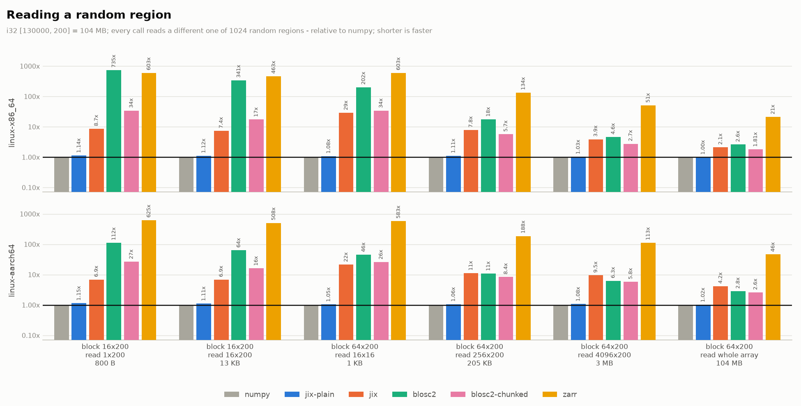

NumPy is the floor, not a competitor: it holds the array uncompressed in RAM and a read is a slice
plus a memcpy. The question this plot answers is what you pay for the four-to-fifty-fold drop in
memory that the next section shows, and how that compares to the other libraries that offer the
same trade.

The first three cases are dominated by per-call overhead. The last three are where each read does
real work, and they are the honest measure of decode throughput - Zarr in particular spends most of
a small read inside its Python indexing layer rather than its codec.

The `block 64x200 / read 16x16` case is the one to learn from: a read smaller than a block still decompresses a
whole block and throws most of it away. **Match the block shape to how you read.** jix picks a
block shape from the CPU cache sizes when you do not pass one, which is a fair default and a poor
choice if your access pattern is lopsided.

`blosc2-chunked` is Blosc2 with `chunks` forced equal to `blocks`. Left to choose for itself Blosc2
picks ~8.7 MiB chunks against a 4 KiB block; the block is still the decompression unit, but walking
a large chunk's block table costs real time - about 2.3x here. It also silently rewrites a
requested `(64, 200)` block to `(52, 200)` unless `chunks` is pinned too. Both arms are on the plot
so Blosc2 is shown at its best as well as at its default.

Absolute numbers

| case | numpy | jix-plain | jix | blosc2 | blosc2-chunked | zarr |
|---|---|---|---|---|---|---|
| block 16x200 read 1x200 800 B | 525 ns | 599 ns | 4.57 us | 385.95 us | 18.11 us | 316.62 us |
| block 16x200 read 16x200 13 KB | 1.14 us | 1.27 us | 8.40 us | 389.09 us | 19.89 us | 527.69 us |
| block 64x200 read 16x16 1 KB | 669 ns | 723 ns | 19.48 us | 134.98 us | 22.92 us | 403.09 us |
| block 64x200 read 256x200 205 KB | 9.48 us | 10.54 us | 73.94 us | 168.73 us | 53.91 us | 1.27 ms |
| block 64x200 read 4096x200 3 MB | 243.59 us | 250.70 us | 946.03 us | 1.13 ms | 669.71 us | 12.52 ms |
| block 64x200 read whole array 104 MB | 18.52 ms | 18.46 ms | 39.11 ms | 48.36 ms | 33.58 ms | 394.03 ms |

### Rust: against a raw `ndarray` slice

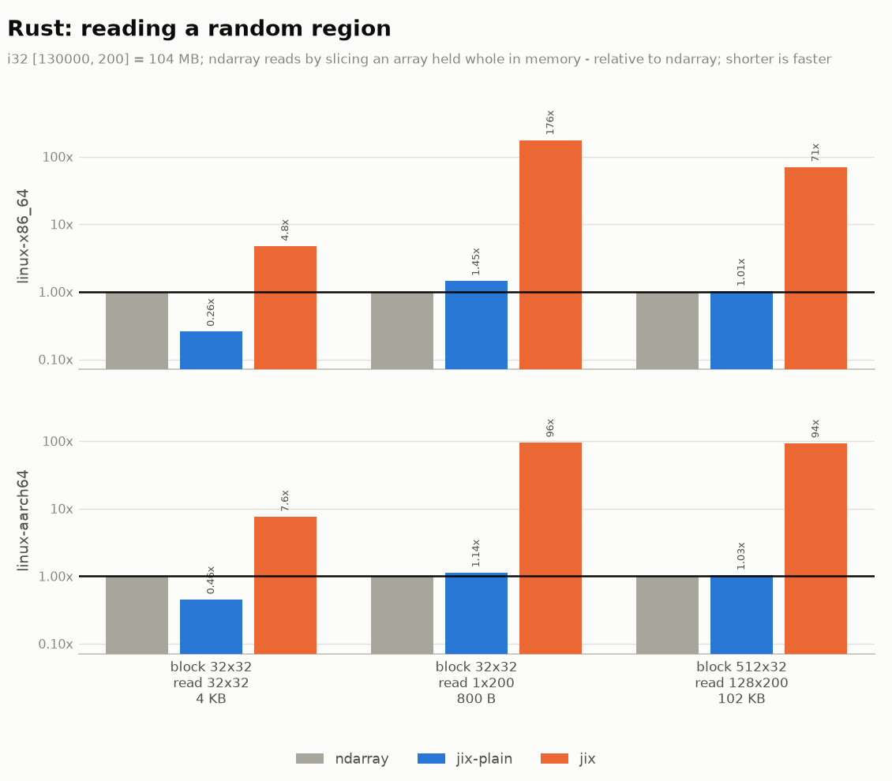

Absolute numbers

| case | ndarray | jix-plain | jix |
|---|---|---|---|
| block 32x32 read 32x32 4 KB | 2.01 us | 521 ns | 9.61 us |
| block 32x32 read 1x200 800 B | 101 ns | 147 ns | 17.82 us |
| block 512x32 read 128x200 102 KB | 4.29 us | 4.35 us | 302.92 us |

---

## Compression

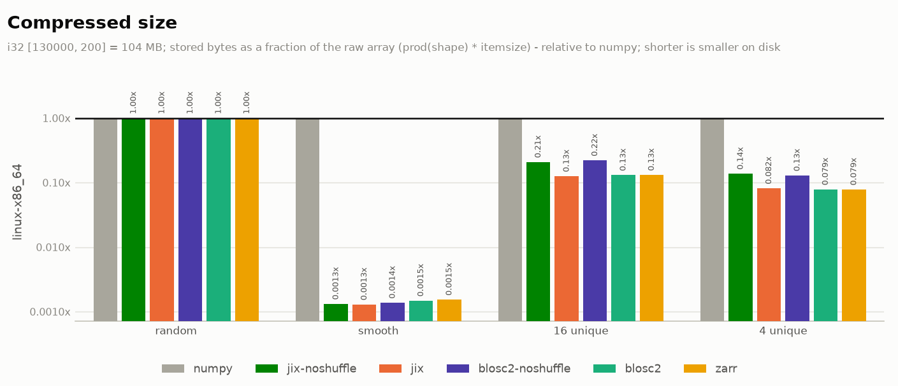

Each bar is what the library stores as a fraction of the raw array, `prod(shape) * itemsize`, so
NumPy is 1x by definition and shorter means smaller on disk. This is the one section where the
unfiltered builds appear, because the byte-shuffle filter is exactly what separates them.

Sizes track Blosc2 closely, which is what should happen - same codec, same filter, so what is
really being measured is the cost of the block layout. Zarr uses Blosc internally and lands on the
same numbers.

Absolute numbers

| case | numpy | jix-noshuffle | jix | blosc2-noshuffle | blosc2 | zarr |
|---|---|---|---|---|---|---|
| random | 1.0x smaller | 1.0x smaller | 1.0x smaller | 1.0x smaller | 1.0x smaller | 1.0x smaller |
| smooth | 1.0x smaller | 753.7x smaller | 769.3x smaller | 724.4x smaller | 672.3x smaller | 649.2x smaller |
| 16 unique | 1.0x smaller | 4.8x smaller | 7.9x smaller | 4.5x smaller | 7.6x smaller | 7.6x smaller |
| 4 unique | 1.0x smaller | 7.3x smaller | 12.2x smaller | 7.7x smaller | 12.7x smaller | 12.7x smaller |

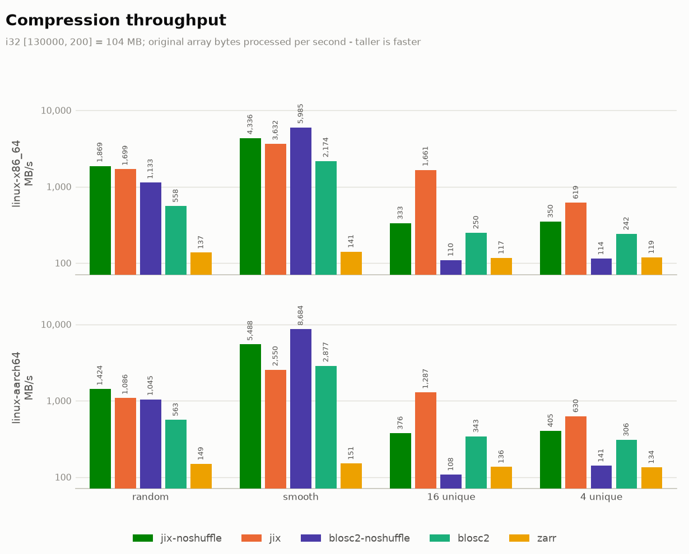

Absolute throughput, in original array bytes per second - no baseline, and taller is faster. This
is the one plot on the page that is not a ratio: there is no meaningful NumPy arm to normalize
against, since not compressing is not a compression speed.

Note that the more compressible the data, the *faster* compression gets. That is the mechanism
behind the distribution cases in the next section.

Absolute numbers

| case | jix-noshuffle | jix | blosc2-noshuffle | blosc2 | zarr |
|---|---|---|---|---|---|
| random | 56 ms | 61 ms | 92 ms | 186 ms | 758 ms |
| smooth | 24 ms | 29 ms | 17 ms | 48 ms | 735 ms |
| 16 unique | 312 ms | 63 ms | 949 ms | 416 ms | 887 ms |
| 4 unique | 297 ms | 168 ms | 908 ms | 430 ms | 877 ms |

---

## Negate

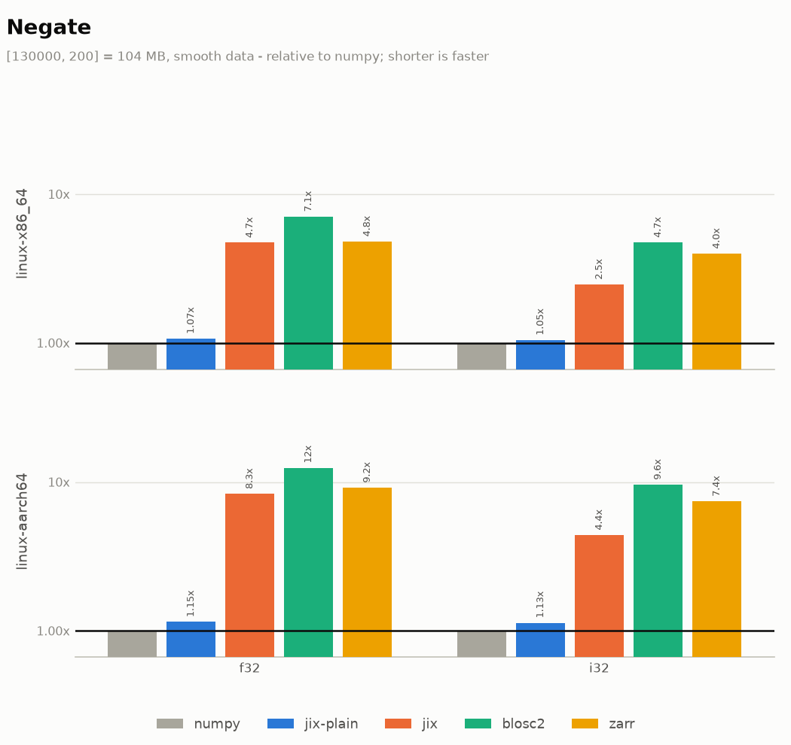

On an uncompressed in-memory buffer jix matches NumPy. That parity is what makes the chain results
further down meaningful: entering a jix pipeline costs nothing that has to be earned back later.

Against the other compressed-array libraries jix is several times faster. Both write their result
into a plain uncompressed NumPy buffer - Blosc2's `expr[:]` does not re-compress on the way out, so
it is not being billed for a pass jix skips.

Absolute numbers

| case | numpy | jix-plain | jix | blosc2 | zarr |
|---|---|---|---|---|---|
| f32 | 17.80 ms | 19.02 ms | 84.03 ms | 125.95 ms | 85.73 ms |
| i32 | 18.15 ms | 18.99 ms | 44.90 ms | 86.05 ms | 72.33 ms |

### The same operation, on data that compresses differently

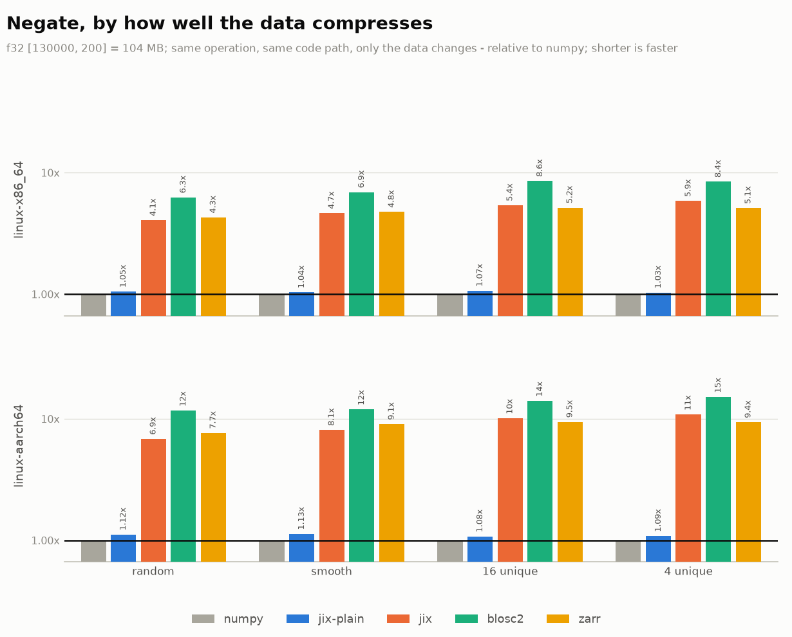

Nothing changes here but the number of distinct values in the data. Better compression means less
memory to move and longer zstd matches, so the operation gets faster. The same effect shows up in
the filter choice: byte-shuffled data negates measurably faster than unshuffled, with identical op
code on both sides.

It does not catch NumPy, and it should not be expected to. An elementwise operation writes a
full-size uncompressed output whatever the input was, so compression only ever helps the read half
of the work.

Absolute numbers

| case | numpy | jix-plain | jix | blosc2 | zarr |
|---|---|---|---|---|---|
| random | 18.71 ms | 19.64 ms | 76.08 ms | 117.55 ms | 80.34 ms |
| smooth | 18.00 ms | 18.67 ms | 83.72 ms | 124.71 ms | 85.80 ms |
| 16 unique | 18.30 ms | 19.58 ms | 98.76 ms | 156.74 ms | 94.67 ms |
| 4 unique | 18.21 ms | 18.83 ms | 106.65 ms | 153.80 ms | 93.31 ms |

---

## Add

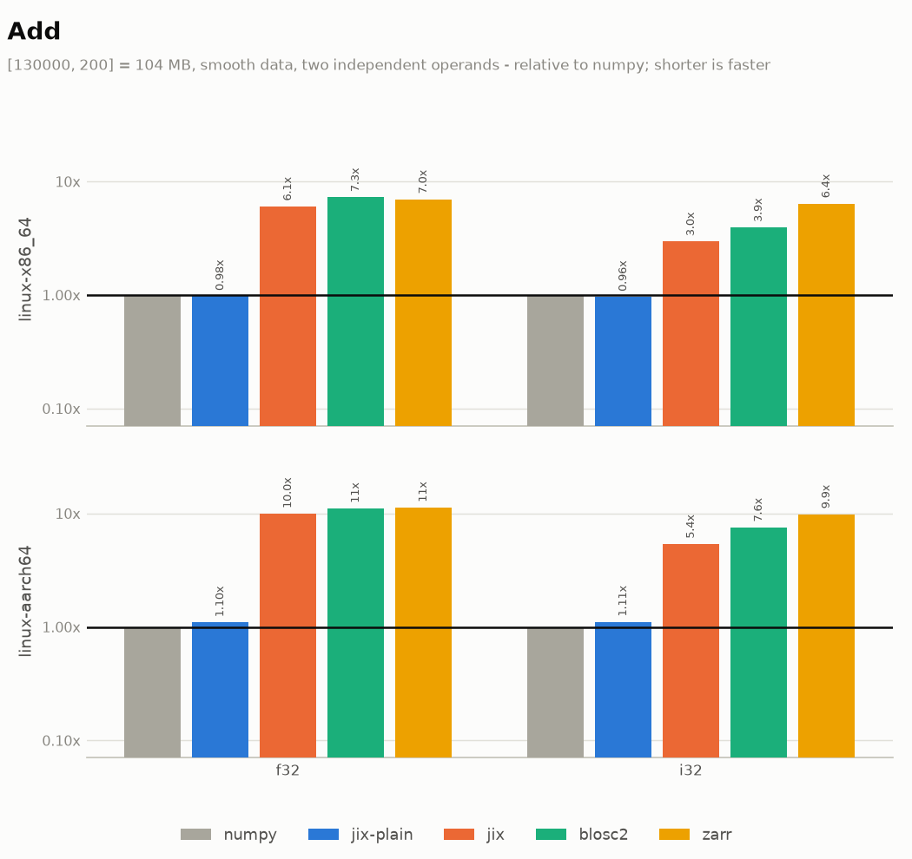

The same shape as negate with two operands instead of one.

Absolute numbers

| case | numpy | jix-plain | jix | blosc2 | zarr |
|---|---|---|---|---|---|
| f32 | 25.44 ms | 24.92 ms | 154.11 ms | 185.11 ms | 177.76 ms |
| i32 | 25.89 ms | 24.98 ms | 76.65 ms | 101.98 ms | 166.03 ms |

---

## Reductions

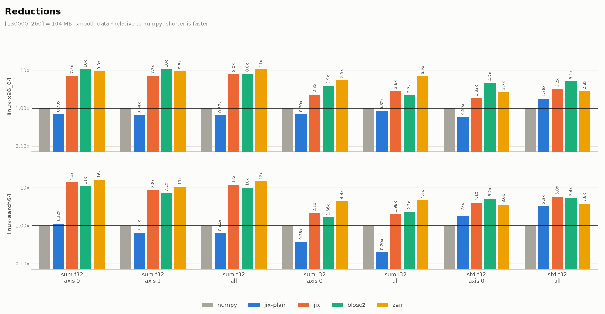

`sum` and `std` are on one plot because they land on opposite sides of the rule, and splitting them
would be choosing which result to show.

jix's reduction kernels read in whatever layout the source already has rather than forcing a
canonical order, and they vectorize integer accumulation that NumPy leaves scalar. **Compare the
two platform rows before reading anything into the integer numbers**: jix's kernels are tuned on
arm64, and NumPy is a general-purpose library with far more x86 attention behind its hot paths.
That is a statement about which machine you are on, not about which library is faster.

`std` goes the other way on every platform - a real deficiency in the kernel rather than a
measurement artifact, and the clearest thing to fix next. On compressed input Blosc2 also edges jix
out on reductions while losing badly on elementwise; both facts are in the same chart.

Absolute numbers

| case | numpy | jix-plain | jix | blosc2 | zarr |
|---|---|---|---|---|---|
| sum f32 axis 0 | 9.81 ms | 6.90 ms | 70.34 ms | 102.35 ms | 90.83 ms |
| sum f32 axis 1 | 9.72 ms | 6.23 ms | 69.54 ms | 102.04 ms | 92.82 ms |
| sum f32 all | 8.68 ms | 5.81 ms | 69.02 ms | 69.69 ms | 91.70 ms |
| sum i32 axis 0 | 15.71 ms | 10.98 ms | 36.24 ms | 60.92 ms | 87.18 ms |
| sum i32 all | 12.14 ms | 9.93 ms | 34.37 ms | 26.90 ms | 83.36 ms |
| std f32 axis 0 | 53.72 ms | 31.49 ms | 97.98 ms | 252.73 ms | 144.39 ms |
| std f32 all | 45.86 ms | 81.65 ms | 145.99 ms | 235.41 ms | 127.85 ms |

### Rust

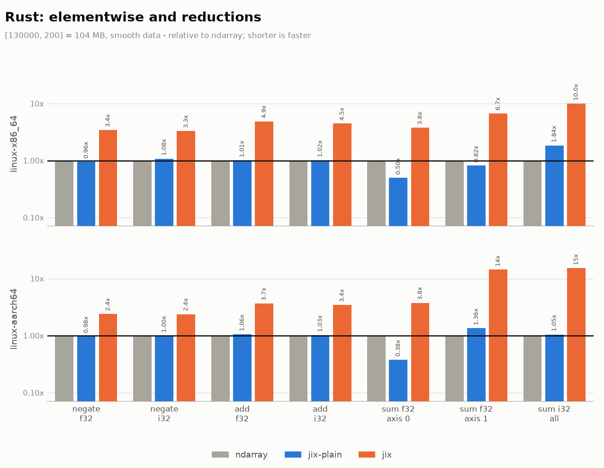

Absolute numbers

| case | ndarray | jix-plain | jix |
|---|---|---|---|
| negate f32 | 19.73 ms | 19.03 ms | 67.42 ms |
| negate i32 | 18.90 ms | 20.41 ms | 62.25 ms |
| add f32 | 24.89 ms | 25.17 ms | 121.56 ms |
| add i32 | 25.18 ms | 25.63 ms | 112.14 ms |
| sum f32 axis 0 | 13.95 ms | 6.98 ms | 52.62 ms |
| sum f32 axis 1 | 7.75 ms | 6.36 ms | 52.26 ms |
| sum i32 all | 4.97 ms | 9.18 ms | 49.69 ms |

---

## Operation chains

Every jix operation returns a lazy view; the whole chain is encoded in the type and runs in a
single pass when output is requested. NumPy and `ndarray` make a full pass per step, so the gap
should widen as the chain gets longer.

Every step is a binary operation over two source arrays, starting from `a*a` - no scalar constants
anywhere. Two reasons: a chain of scalar operations would measure jix's handling of a 0-stride
operand rather than whether fusing pays off, and a chain of scalar constants can be constant-folded
by a compiler into a single operation, which measures nothing at all.

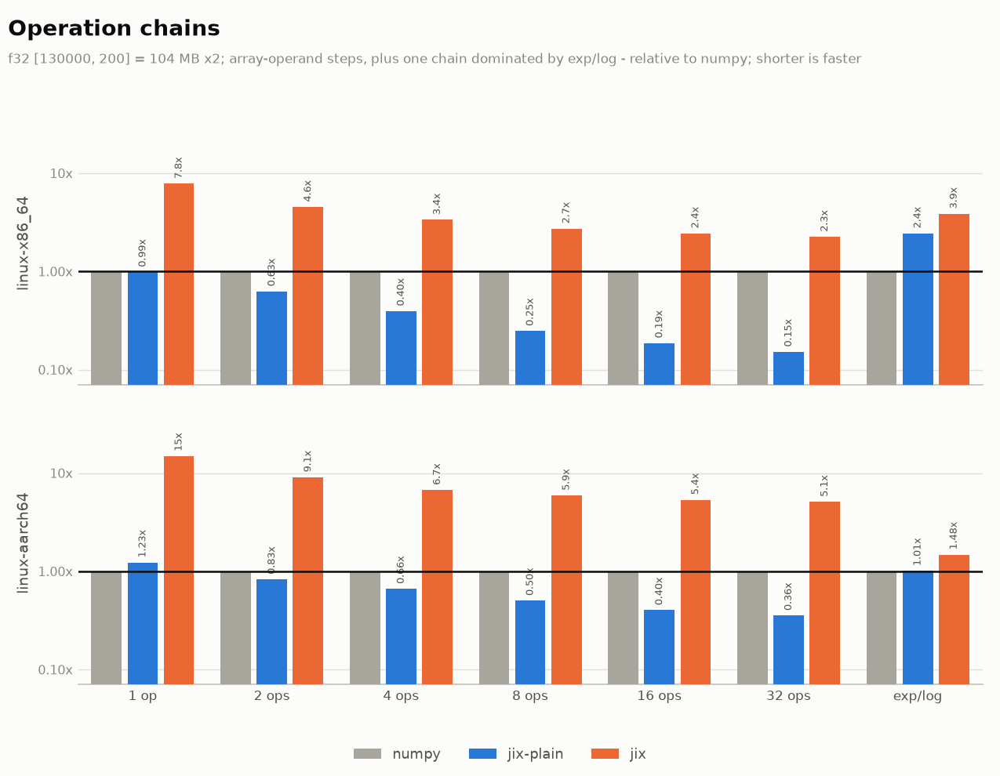

A chain of N steps is N x 26M element-operations whether or not it is fused, so the total time
grows either way. What fusing removes is the memory traffic: NumPy re-reads an operand and writes a
full intermediate per step, while jix materializes the chain one read region at a time, so every
intermediate for that region stays in cache. The bars show whether that saved traffic is enough to
win, which is why the trend across chain lengths is the result and a single length would be a
number with no mechanism behind it.

Everything here runs at jix's default read region. That default is derived from the CPU's cache
sizes, and on a machine with a large L2 it comes out far larger than a chain wants - shrinking it
to a region that fits L1 is worth a further 1.4x on the longest chains. That is a tuning result
rather than what a caller gets by default, so it is not what these bars show; the measurement is in
the repository's benchmark notes.

`f32` only here; the integer chain behaves the same way and adds nothing but width.

The `exp/log` case is the counter-example, and it is on the plot on purpose. `log(exp(a) + exp(b))`
is dominated by transcendental math rather than memory traffic, so the libm implementation decides
the outcome and the intermediates jix saves are noise beside it. Chains win when the operations are
cheap and the array is large; they do not when one expensive kernel dominates.

Absolute numbers

| case | numpy | jix-plain | jix |
|---|---|---|---|
| 1 op | 19.35 ms | 19.13 ms | 151.57 ms |
| 2 ops | 49.17 ms | 30.92 ms | 223.85 ms |
| 4 ops | 106.82 ms | 42.33 ms | 358.31 ms |
| 8 ops | 225.77 ms | 56.09 ms | 616.84 ms |
| 16 ops | 459.47 ms | 85.79 ms | 1.12 s |
| 32 ops | 934.29 ms | 142.36 ms | 2.11 s |
| exp/log | 91.43 ms | 223.73 ms | 353.62 ms |

### Peak memory

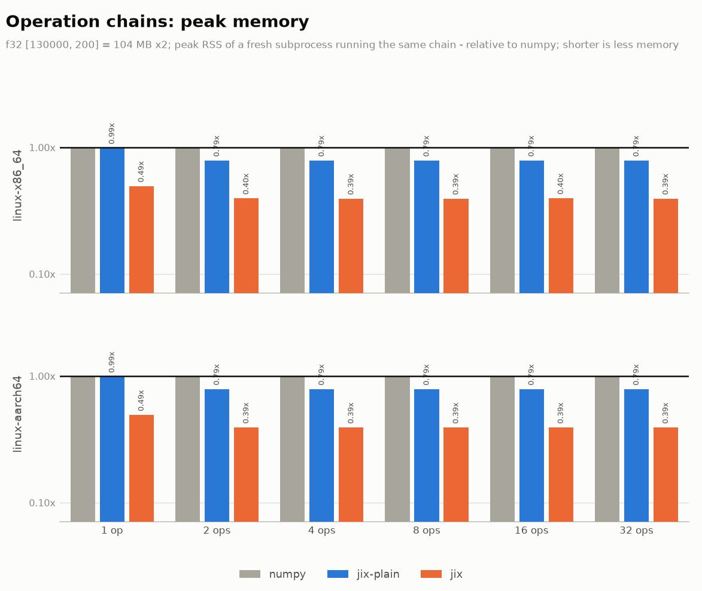

Peak RSS of a fresh subprocess running the same chain, so NumPy's C-level allocations are included.

All three are flat across chain length, and that is worth being precise about: NumPy allocates an
intermediate per step but frees each one as the next is produced, so its peak is the two inputs
plus one live intermediate, not a growing pile. Avoiding intermediates entirely is therefore worth
a fifth, not a multiple.

The real difference is what the arrays cost to hold. The compact arm keeps its inputs compressed
for the whole computation, and that is where the factor comes from. Memory has no noise floor,
which makes this the cleanest measurement on the page.

Absolute numbers

| case | numpy | jix-plain | jix |
|---|---|---|---|
| 1 op | 385 MB | 382 MB | 191 MB |
| 2 ops | 484 MB | 382 MB | 192 MB |
| 4 ops | 484 MB | 382 MB | 191 MB |
| 8 ops | 484 MB | 382 MB | 191 MB |
| 16 ops | 484 MB | 382 MB | 192 MB |
| 32 ops | 484 MB | 382 MB | 191 MB |

### Rust

The Rust half runs the same chain against `ndarray` in its efficient form - an owned left operand
reuses its buffer, so it does not allocate per step, but it still makes one full read-write pass
per step.

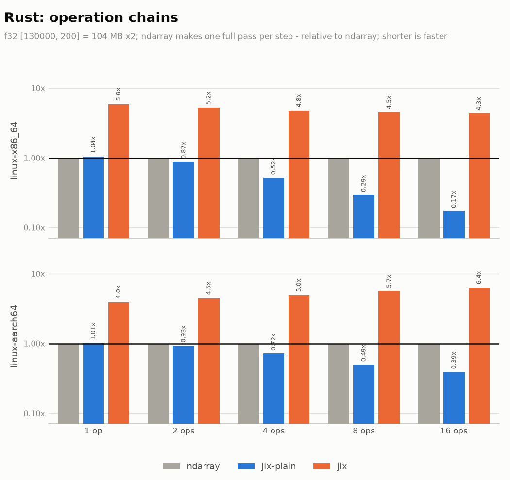

Absolute numbers

| case | ndarray | jix-plain | jix |
|---|---|---|---|
| 1 op | 19.91 ms | 20.70 ms | 117.81 ms |
| 2 ops | 32.90 ms | 28.69 ms | 171.67 ms |
| 4 ops | 56.22 ms | 29.19 ms | 269.76 ms |
| 8 ops | 103.05 ms | 30.08 ms | 467.18 ms |
| 16 ops | 197.82 ms | 34.10 ms | 855.87 ms |

---

## A reduction inside a broadcast

`a / a.std(axis)`, with the reduction broadcast back over the array, is a different shape from an
elementwise chain, and it is the case where laziness costs rather than pays.

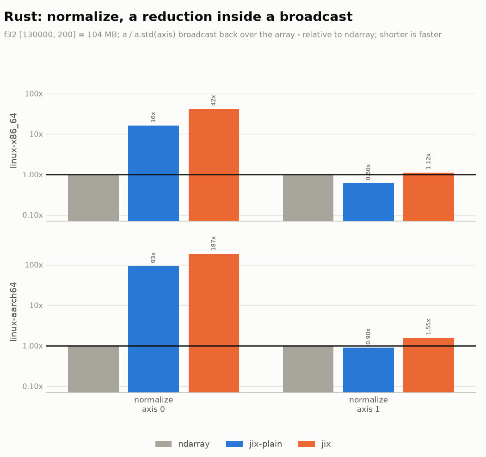

The reduction sits inside the lazy pipeline, so producing an output element re-runs it over that
element's whole column: O(N*M) instead of O(N+M). Over axis 0 the reduced axis is 130000 elements
long and the result is what the plot shows. Over axis 1 it is 200 elements and jix comes out ahead.

This is not a kernel deficiency, it is what fusing a broadcast reduction means, and the remedy is
the one the `ops` module already gives for reshape: materialize the reduction before broadcasting
it when the reduced axis is long. It is on the page because a caller who writes this expression
without knowing that will pay for it.

Absolute numbers

| case | ndarray | jix-plain | jix |
|---|---|---|---|
| normalize axis 0 | 100.07 ms | 1.61 s | 4.21 s |
| normalize axis 1 | 189.74 ms | 114.51 ms | 212.31 ms |

<!--
The axis-order section is withheld. The benchmark it relied on measured nothing - see
FINDINGS.md - and the fixed version has not been run yet. Restore this section, with
<!- - plot:rust_axis_order - -> and <!- - table:rust_axis_order - ->, once a run includes it.
-->

## Reproducing

    python jix/benches/run.py --report          # rust, only the comparison benches
    python jix-py/python/benches/run_all.py     # python

The CI matrix across the three runners is documented in
[`docs/benchmarks.md`](../docs/benchmarks.md), along with `scripts/bench/compare.py` for
same-machine A/B against a base ref. Every plot and every table on this page is generated from the
benchmark JSON by `benches/report_bars.py`; nothing is typed by hand.
